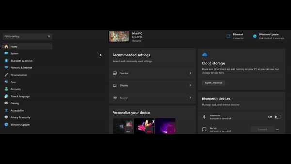
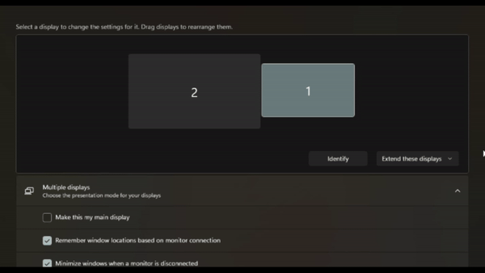

# Windows 10/11 Display setting scripts

A set of Windows batch file scripts that will change your display settings.

## NOTE

These scripts are intended for dual display setups and will only work on Windows 10 and 11 systems.

## Purpose

These are individual scripts that will change your display settings without you having to go to your settings to change them.

### Prerequisites

Understand the following before running a script:

* Understand the layout of your dual display setup.
* Head to your settings and identify your displays.
* Each display will be identified with a number. Take note of these numbers.

### Installation

To execute a script, simply double click on the file.

## Usage

1. InternalDisplay.bat
   - Display only on display 1
   - Performs 'Show only on 1'
2. ExternalDisplay.bat
   - Display only on display 2
   - Performs 'Show only on 2'
3. DuplicateDisplays.bat
   - Clone/Duplicate the displays
   - Performs 'Duplicate these displays'
4. ExtendDisplays.bat
   - Extend the displays
   - Performs 'Extend these displays'
